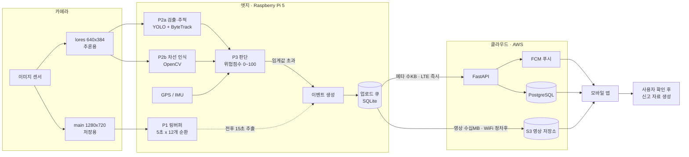

# 전체 시스템 아키텍처 (컨텍스트 다이어그램)

**버전** 0.1
**원본** 강섬희 (HW 파트) 작성
**AI 파트 반영** 설만수 — P2 세부(검출·추적 / 차선 인식 분리) 추가
**최종 수정** 2026-09-14

---

## 이 문서의 성격

이 문서는 SafeWatch 프로젝트 **전체**(카메라 → 엣지 → 클라우드 → 앱)의 시스템 컨텍스트를 보여준다. `pipeline-architecture.md`가 다루는 8개 모듈(INPUT~PRIVACY)은 이 다이어그램의 **엣지(Raspberry Pi 5) 안, P2·P3 부분**에 해당한다.

**이 저장소(AI 파트)가 실제로 구현하는 범위**는 아래 다이어그램의 P2(검출·추적·차선 인식)와 P3(위험 판단), 그리고 이벤트 판정 로직까지다. 카메라 하드웨어 구성, P1 링 버퍼·업로드 큐 등 엣지 시스템 통합, 클라우드(AWS), 모바일 앱은 HW·서버·앱 파트가 각자의 저장소에서 구현한다. 저장소 경계는 `README.md` "프로젝트 정보" 참고.

원본 다이어그램은 HW 파트에서 시스템 통합 관점으로 작성한 것이라 P2를 "YOLO + ByteTrack"으로만 표기했다. AI 파트 실제 설계(`pipeline-architecture.md`)에는 차선 인식(LANE)이 검출·추적과 나란히 존재하는 핵심 모듈이므로, 아래 다이어그램은 P2를 P2a(검출·추적)/P2b(차선 인식)로 분리해 반영했다.

---

## 다이어그램

---

## 단계별 설명 및 저장소 경계

| 구성 요소 | 설명 | 담당 |
|---|---|---|
| 카메라 (dual-stream) | lores(640×384, 추론용) / main(1280×720, 저장용) 두 스트림을 동시 출력 | HW |
| P2a 검출·추적 | YOLOv8n + ByteTrack — `pipeline-architecture.md` 3.2, 3.4 | **AI (이 저장소)** |
| P2b 차선 인식 | OpenCV 기반 lane offset 산출 — `pipeline-architecture.md` 3.3 | **AI (이 저장소)** |
| P3 판단 | GPS/IMU + P2a/P2b 결합 위험 점수 산출 — `pipeline-architecture.md` 3.5~3.6, `risk-criteria.md` | **AI (이 저장소)** |
| P1 링 버퍼 | main 스트림을 5초 세그먼트 × 12개로 순환 보관, 이벤트 시 전후 15초 추출 | HW / 엣지 시스템 통합 (owner 확인 필요 — 아래 참고) |
| 이벤트 생성 · 업로드 큐 | 임계값 초과 시 이벤트 확정, SQLite 큐에 적재 | AI 판정 로직은 이 저장소, 큐잉·전송은 owner 확인 필요 |
| 클라우드 (AWS) | FastAPI, PostgreSQL, S3, FCM | 서버 파트 (별도 저장소) |
| 모바일 앱 | 사용자가 최종 확인 후 신고 자료 생성 — AI는 후보만 제시 (`risk-criteria.md` 5장 원칙과 일치) | 앱 파트 (별도 저장소) |

---

## 이 다이어그램으로 정리된 것

- **GPS 입력 경로** (`pipeline-architecture.md` 미결 사항) — GPS/IMU가 결합된 하나의 입력으로 P3에 들어오는 것으로 확인. 다만 ESP32 경유 여부 등 구체 프로토콜은 HW 파트 확인 필요.
- **링 버퍼 저장 방식** (`pipeline-architecture.md` 미결 사항) — 무압축 연속 버퍼가 아니라 **5초 세그먼트 × 12개 순환(총 60초 용량), 이벤트 시 전후 15초 추출** 방식으로 확인. `configs/default.yaml`의 `event.clip_pre_sec(10) + clip_post_sec(5) = 15초`와 정확히 일치한다.
- **전송 방식** (`event-schema.md` 협의 필요 1번) — HW 파트는 **메타데이터(JSON, 수KB)는 LTE로 즉시 전송, 영상 클립(수십MB)은 WiFi 연결 시(정차 후) 전송**하는 하이브리드 방식을 전제로 설계함. 기존 A안(메타 우선)/B안(클립 우선) 논의와 별개로 "즉시성이 다른 두 데이터를 다른 네트워크로 분리 전송"하는 제3안. **서버 파트 확인 및 확정 필요.**

## 아직 남은 것

- **P1 링 버퍼 / 업로드 큐의 구현 주체** — 이 저장소(AI 파트, `src/event/`)가 구현하는 범위인지, HW 파트의 엣지 시스템 통합 코드가 담당하는지 팀 내 확인 필요. `pipeline-architecture.md` EVENT 모듈은 현재 이 저장소가 클립 추출까지 담당하는 것으로 서술되어 있어, 확인 후 불일치하면 문서를 수정해야 한다.
- **dual-stream 구현 범위** — AI 파트(`src/input/`)가 lores 스트림만 받는지, 아니면 main 스트림도 함께 받아 관리하는지 확인 필요. 현재 `src/input/source.py`는 단일 해상도 스트림만 가정하고 있다.
- P2a/P2b 분리 표기는 AI 파트가 추가한 것이며 원본 다이어그램에는 없었음 — HW 파트와 공유해 컨펌 필요.
- `configs/default.yaml`의 `input.resolution`은 현재 `[640, 640]`(dev) / `[320, 320]`(pi5)로, 이 다이어그램의 lores 해상도(640×384)와 다르다. lores 해상도가 확정되면 config 값을 맞춰야 한다.

---

## 변경 이력

| 버전 | 일자 | 내용 |
|---|---|---|
| 0.1 | 2026-09-14 | HW 파트 원본 다이어그램에 AI 파트 세부(P2a/P2b 분리) 반영하여 최초 작성 |
